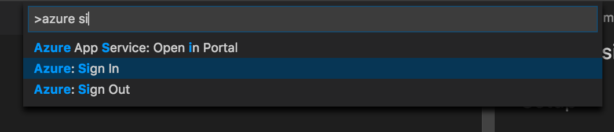
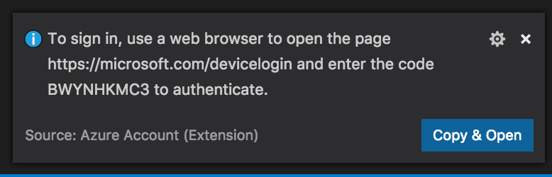
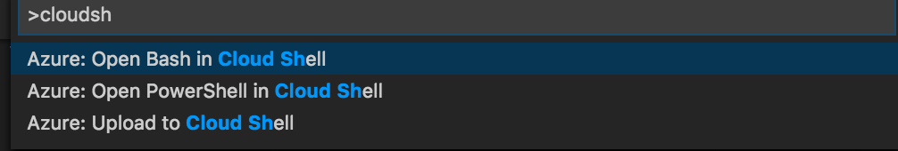
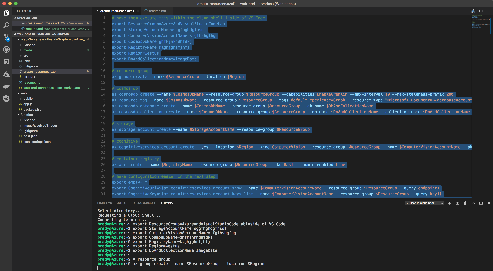

## Prerequisites

## Setup

1. Clone this repository.
1. CD into the directory and type `code .\web-and-serverless.code-workspace`.
1. Log into Azure using Visual Studio Code's **Sign In** command. 

    

1. You'll see a prompt in Visual Studio Code. Click the button and you'll be sent to a login site where you can paste in the login code. 

    

1. Once the browser lets you know you're logged in, flip back to VS Code. 

1. Open the **Azure Cloud Shell** in bash mode by using the `Open Bash in Cloud Shell` command. 

    

1. The Cloud Shell will open a bash terminal in the integrated terminal window in Visual Studio Code. 

    

1. Open the `create-resources.azcli` file and edit the first few lines, to set the variables according to your needs. 

    ```bash
    export ResourceGroup=AzureAndVisualStudioCodeLab
    export StorageAccountName=AzureAndVisualStudioCodeLab
    export ComputerVisionAccountName=AzureAndVisualStudioCodeLab
    export CosmosDbName=AzureAndVisualStudioCodeLab
    export RegistryName=AzureAndVisualStudioCodeLab
    ```

1. Select all of the text in the `.azcli` file, and then use the `Cmd+'` or `Ctrl+'` key to run the code in the terminal. This will pump the code into the Cloud Shell terminal below and start creating the resources you'll need for the lab. 

    


## Configuration

Once the resources have been created, you need to configure the app using Visual Studio Code's Azure features. The files `.env` and `function\host.settings.json` according to the bash script output and by using the Storage extension in Visual Studio Code. 