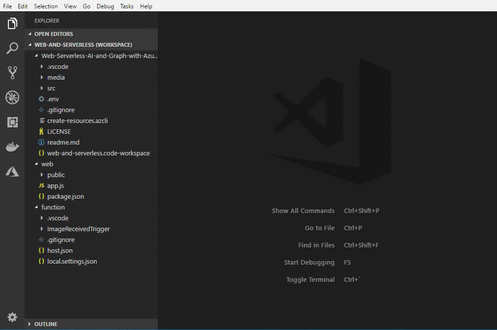
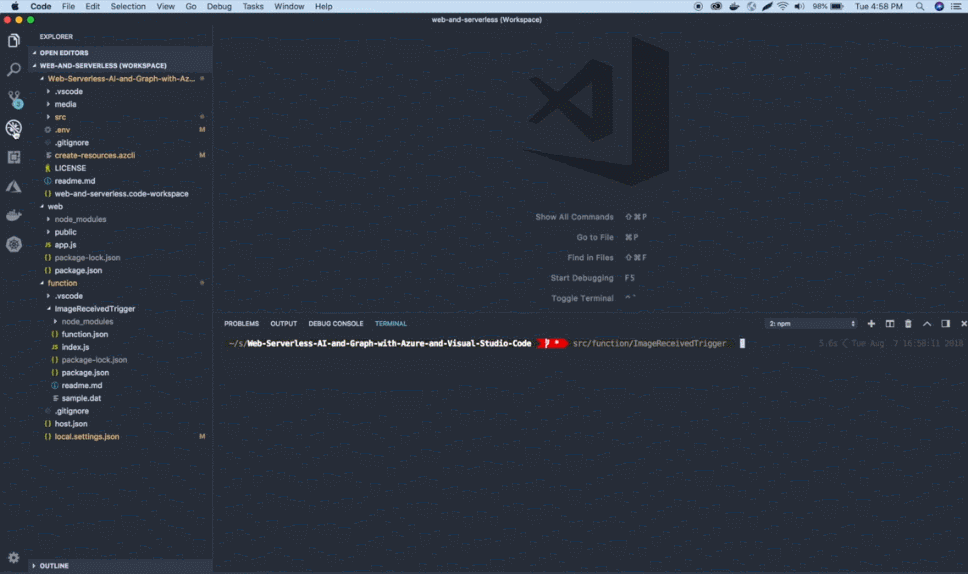
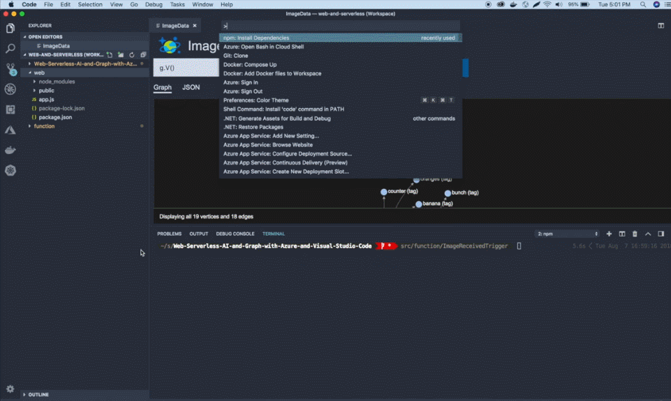
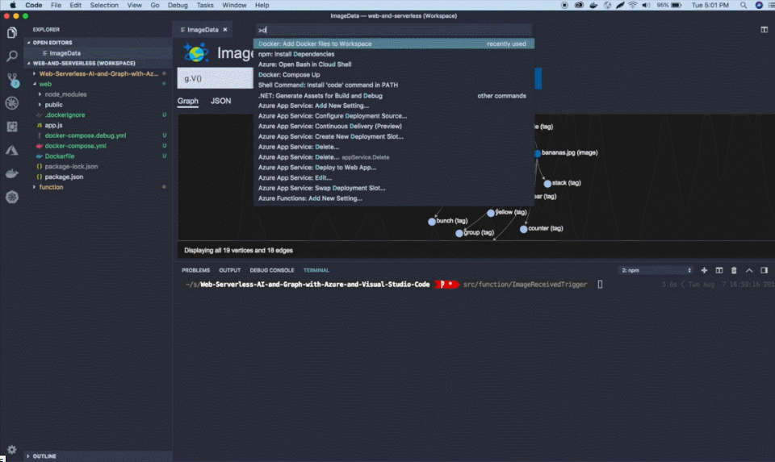
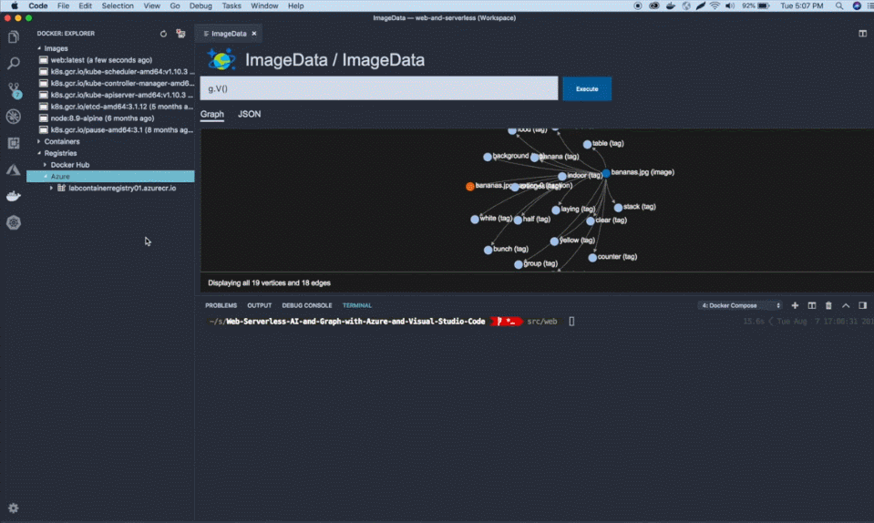
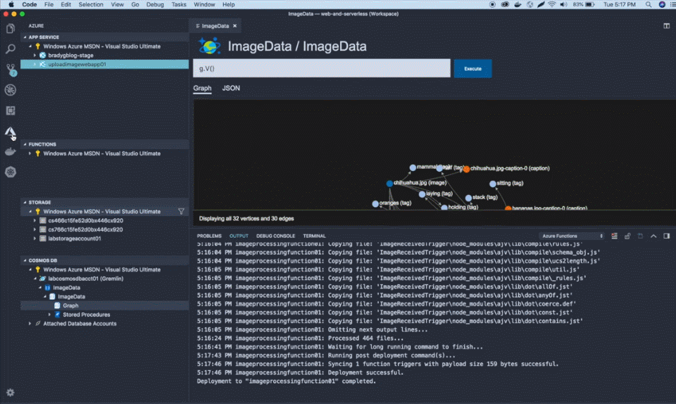
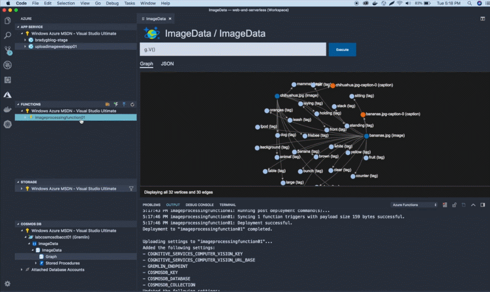

# Build a cloud-native application using the web, serverless, and AI with Visual Studio Code

## Overview
In this lab, you’ll learn how to use Visual Studio Code and the variety of extensions for Microsoft Azure to build a cloud-native application using web, serverless, and AI. You’ll clone a repository containing the code for a web app and a serverless Azure Function. The web app allows users to upload images, which are then analyzed using Cognitive Services Computer Vision APIs to determine the subject of the image. The metadata interrogated from the image is then saved to a Cosmos DB database using the Gremlin (or graph) API. You’ll deploy the app to Azure and configure it all within Visual Studio Code. 

## What’s covered in this lab?

In this lab, you will

1. Provision the required Azure Resources using **Azure CLI** includes Azure Container Registry, Cognitive Service, Storage account, Cosmos DB etc..

1. Add Docker support for the web app, build the Docker image and push to Azure ACR. Then deploy the web image to Azure app service.

1. Deploy a serverless Azure Function to Azure Function App.

## Prerequisites
* [Git](https://git-scm.com/downloads)
* [Docker](https://www.docker.com/get-docker)
* [Node.js](https://nodejs.org) (Latest LTS)
* [Visual Studio Code](http://code.visualstudio.com), with the following  extensions installed:
    * [Azure App Service](https://marketplace.visualstudio.com/items?itemName=ms-azuretools.vscode-azureappservice)
    * [Azure Cosmos DB](https://marketplace.visualstudio.com/items?itemName=ms-azuretools.vscode-cosmosdb)
    * [Azure Functions](https://marketplace.visualstudio.com/items?itemName=ms-azuretools.vscode-azurefunctions)
    * [Azure Storage](https://marketplace.visualstudio.com/items?itemName=ms-azuretools.vscode-azurestorage)
    * [Docker](https://marketplace.visualstudio.com/items?itemName=PeterJausovec.vscode-docker)
    * [npm](https://marketplace.visualstudio.com/items?itemName=eg2.vscode-npm-script)
    * [Azure CLI Tools](https://marketplace.visualstudio.com/items?itemName=ms-vscode.azurecli)
* [Azure CLI](https://docs.microsoft.com/en-us/cli/azure/install-azure-cli?view=azure-cli-latest)
* [Azure Functions CLI](https://github.com/Azure/azure-functions-cli)

* **Microsoft Azure Account**: You will need a valid and active Azure account for the Azure labs. If you do not have one, you can sign up for a [free trial](https://azure.microsoft.com/en-us/free/){:target="_blank"}

   * If you are a Visual Studio Active Subscriber, you are entitled to a $50-$150 credit per month. You can refer to this [link](https://azure.microsoft.com/en-us/pricing/member-offers/msdn-benefits-details/) to find out more including how to activate and start using your monthly Azure credit.

   * If you are not a Visual Studio Subscriber, you can sign up for the FREE [Visual Studio Dev Essentials](https://www.visualstudio.com/dev-essentials/)program to create **Azure free account** (includes 1 year of free services, $200 for 1st month).

## Setup the environment
### Clone the repository
Clone the source repository from https://github.com/bradygmsft/Web-Serverless-AI-and-Graph-with-Azure-and-Visual-Studio-Code.git and open the `web-and-serverless.code-workspace` in VS code.


### Provision the Azure Resources :
  
  In this step, you'll create all of the Azure resources required for this lab. This consists of Azure Container Registry, Cognitive Service, Storage account, Cosmos DB etc..

  1. Log into Azure using Visual Studio Code's Sign In command. You'll see a prompt in Visual Studio Code for Device Authentication. Click the **Copy&Open** button and you'll be sent to a login site where you can paste in the login code and sign in.

     

  1. Open the Azure Cloud Shell in bash mode by using the `Open Bash in Cloud Shell` command. The Cloud Shell will open a bash terminal in the integrated terminal window in Visual Studio Code. Open the `create-resources.azcli` file and edit the first few lines, to set the variables according to your needs. 

      ```bash
      export ResourceGroup=AzureAndVisualStudioCodeLab
      export StorageAccountName=AzureAndVisualStudioCodeLab
      export ComputerVisionAccountName=AzureAndVisualStudioCodeLab
      export CosmosDbName=AzureAndVisualStudioCodeLab
      export RegistryName=AzureAndVisualStudioCodeLab
      ```
      Select all the text in the `.azcli` file, and then right click on the code , select **Run Line in Terminal** to run the code in the terminal. This will copy the code into the Cloud Shell terminal below and start creating the resources you'll need for the lab. 
   
     
   
### Configure the application

Once the resources have been created, you need to configure the application using Visual Studio Code's Azure features. Replace the variables values in the files `.env` and `function\host.settings.json` according to the bash script output and by using the **Storage extension** (to get the storage account connection string) in Visual Studio Code.

   

## Task 1: Build and debug the application locally

Now you are ready with the required Azure resources and configuration files to proceed with this lab. In this exercise, you will build and debug the application locally.

1. Install npm dependencies for web and function app.
      
      
      
1. Click on the **Debug** icon in the Activity Bar on the side of VS Code. Select **Hybrid** configuration in the Debug configuration drop down. This will run both the web app and function app locally.
    
     

1. Click on the **Azure** icon in the Activity Bar. Select **Graph** of the Cosmos DB you created earlier and click on Execute. You will see an empty graph. 

     

1. Open the browser and browse `http://localhost:3000` to access the web app. Click on **Choose File** and select an image and click on **Upload**. (Download and keep a few images for this lab purpose)
       
      

   Now Execute the Graph again. This time you could see a graph data for the uploaded image.

   > When you click on Upload, the image will be uploaded to Storage account and ImageReceivedTrigger function will be triggered. Cosmos DB Gremlin API gets the image from the Storage account and Computer Vision Cognitive service (AI) perform an analysis on the image uploaded. The Computer Vision analysis will be saved to Cosmos DB graph with Tags and Captions.

## Task 2: Add the docker support and Deploy the web app to Azure

 In this exercise, you will add Docker support for the web application, build and deploy the Docker image to Azure App service.

 1. Writing Docker and docker-compose files by hand can be tricky and time-consuming. To help you, VS Code can generate the necessary Docker files for your project. From the Command Palette (Ctrl+Shift+P), run the `Docker: Add Docker files to Workspace` command to generate `Dockerfile, docker-compose.yml,` and `docker-compose.debug.yml` files for your workspace type:

     

     Once the Docker files are generated open the `docker-compose.yml` file and change the ports section from `3000:3000` to `80:3000`.

1. Now run the `Docker: Compose Up` command from the Command Palette (Ctrl+Shift+P). This command builds and creates an image for web app with the tag `web: latest`

     

1. Login to Azure Container Registry (ACR) from the terminal using `az acr login -n acrname -g resourcegroupname` command as shown below. 

   

1. Now tag the web app image with `youracrname.azurecr.io/web` and push the image to ACR.

   

   You can find the pushed image under the Registries node in the Docker explorer as shown in the image.

1. With the Docker Explorer, you can deploy images from  Azure Container Registries, directly to an Azure App Service instance. You can now right click on the image in Azure Container Registry and choose **Deploy Image to Azure App Service**. From here, you will be prompted for an Azure Resource Group, a location, an App Service Plan, and a globally unique website name.

   

1. Once the app is deployed successfully copy the setting in `.env` file and add it to App service Application Settings as shown below
     
     

1. To verify the deployed application working fine, browse the website and start the `ImageReceivedTrigger` Function locally. Now upload another image from the website and verify the image analysis is updated to Graph.

   


In this exercise, you built and deployed Docker image to Azure App service.

## Task 3: Deploy Function to Azure Function app

In this exercise, you will deploy ImageReceivedTrigger Java Script Function to Azure Function App.

1. Right click on the function folder and select **Deploy to Function App**. You will be prompted for Function name, a unique Function App name, and storage account.

   

1. Once the Function App is deployed successfully you can see the function under **Functions** node in Azure Explorer.
   
   

1. Now you need to update the Function app application settings with the values in `local.settings.json`. Right click on Application settings and select **Upload local settings**. Then select `local.settings.json` from the options.

   

1. Now let us enable log streaming for Function app to view the log activity.

   

1. Now you have completed the deployment. You can verify both website and function working properly by uploading an image from you azure website.
      

   Congratulations! You have completed this lab. In this lab, you deployed a simple image uploader web app and an azure function which triggers the cognitive service when an image uploaded to the storage account. And Cognitive service analysis will be stored in the Cosmos Db graph.
